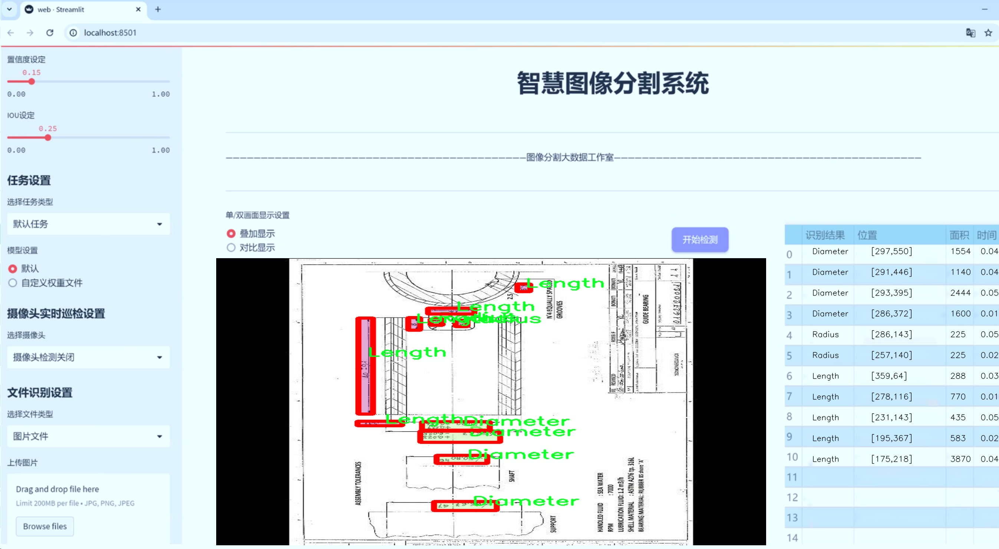
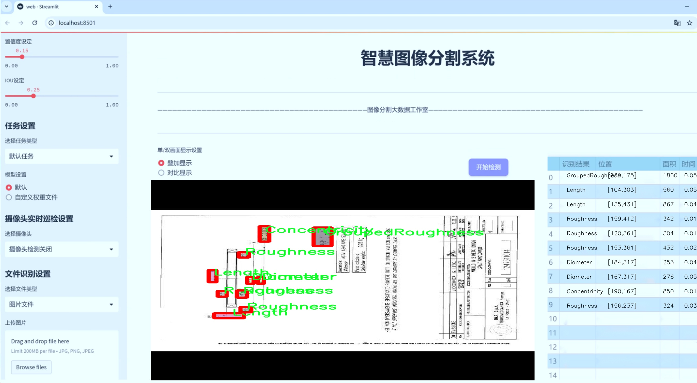
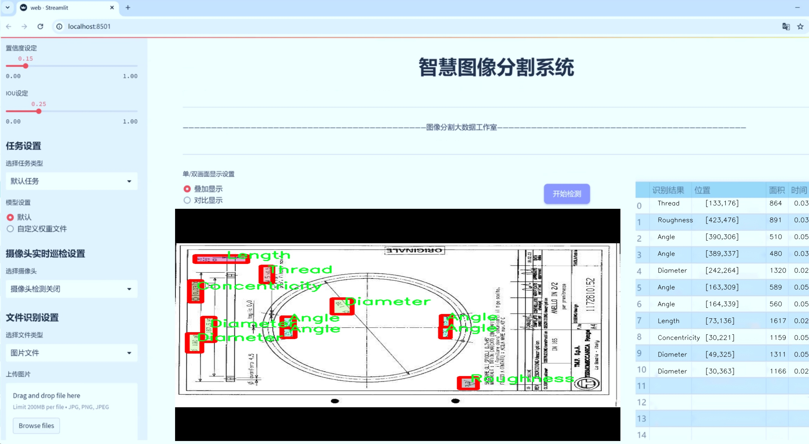
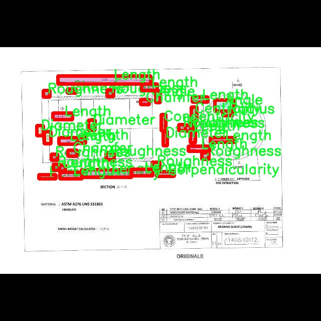
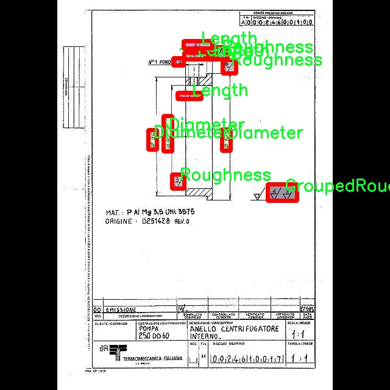
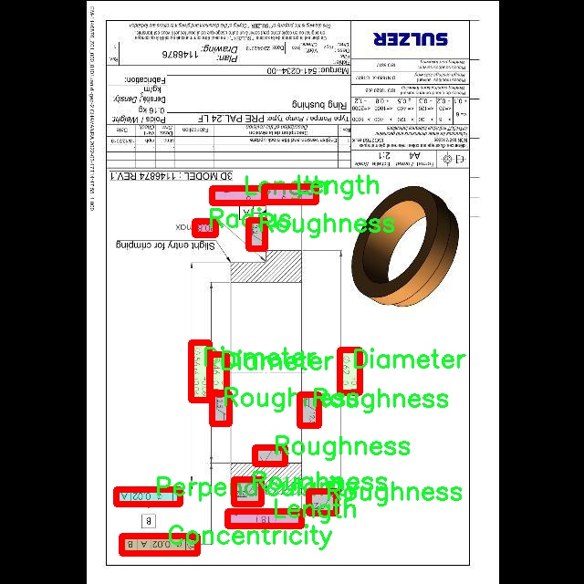
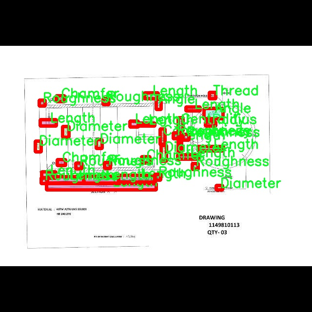
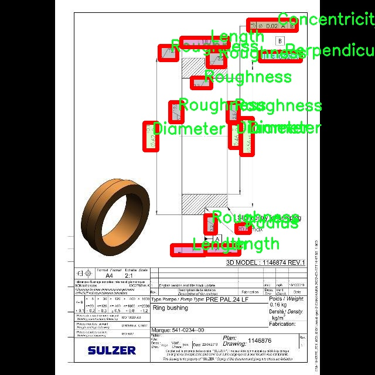

# 工图符号识别分割系统源码＆数据集分享
 [yolov8-seg-C2f-DySnakeConv＆yolov8-seg-C2f-RFCBAMConv等50+全套改进创新点发刊_一键训练教程_Web前端展示]

### 1.研究背景与意义

项目参考[ILSVRC ImageNet Large Scale Visual Recognition Challenge](https://gitee.com/YOLOv8_YOLOv11_Segmentation_Studio/projects)

项目来源[AAAI Global Al lnnovation Contest](https://kdocs.cn/l/cszuIiCKVNis)

研究背景与意义

在现代工业设计与制造过程中，工图符号的识别与解析是确保产品质量和设计意图传达的重要环节。工图符号不仅包含了产品的几何特征、尺寸要求，还传达了制造和检验的标准。因此，准确识别和解析工图符号对于提高生产效率、降低误差率以及实现智能制造具有重要意义。随着计算机视觉技术的快速发展，基于深度学习的图像识别方法逐渐成为工图符号识别领域的研究热点。其中，YOLO（You Only Look Once）系列模型因其高效的实时目标检测能力而受到广泛关注。尤其是YOLOv8模型，凭借其在精度和速度上的优势，为工图符号的自动识别提供了新的可能性。

本研究旨在基于改进的YOLOv8模型，构建一个高效的工图符号识别分割系统。通过对工图符号的实例分割，不仅可以识别出符号的类别，还能够精确地提取出符号的形状和位置，从而为后续的自动化处理提供可靠的数据支持。我们使用的数据集包含1700张图像，涵盖17种不同的工图符号类别，包括角度、中心度、直径、平面度等。这些符号在实际工程应用中频繁出现，具有较高的实用价值。通过对这些符号的深度学习训练，期望系统能够在多种复杂场景下保持高效的识别能力。

此外，工图符号的多样性和复杂性为识别系统带来了挑战。不同符号的形状、大小和排列方式各异，且在实际应用中可能受到噪声、模糊和遮挡等因素的影响。因此，改进YOLOv8模型的关键在于增强其对复杂背景和多样化符号的适应能力。通过引入数据增强技术、改进网络结构以及优化训练策略，我们希望能够显著提升模型的识别精度和鲁棒性。

本研究的意义不仅在于推动工图符号识别技术的发展，更在于为智能制造和工业自动化提供新的解决方案。随着工业4.0的到来，传统的人工识别方式已无法满足高效、精准的生产需求。通过构建基于深度学习的自动识别系统，可以有效减少人工干预，提高生产线的自动化水平，从而降低人力成本和出错率。此外，该系统的成功应用还将为相关领域的研究提供借鉴，推动计算机视觉技术在更广泛的工业应用中的落地。

综上所述，基于改进YOLOv8的工图符号识别分割系统的研究，不仅具有重要的理论价值，也具备广泛的实际应用前景。通过深入探索深度学习在工图符号识别中的应用，我们期望能够为工业设计与制造领域的智能化转型贡献一份力量。

### 2.图片演示







##### 注意：由于此博客编辑较早，上面“2.图片演示”和“3.视频演示”展示的系统图片或者视频可能为老版本，新版本在老版本的基础上升级如下：（实际效果以升级的新版本为准）

  （1）适配了YOLOV8的“目标检测”模型和“实例分割”模型，通过加载相应的权重（.pt）文件即可自适应加载模型。

  （2）支持“图片识别”、“视频识别”、“摄像头实时识别”三种识别模式。

  （3）支持“图片识别”、“视频识别”、“摄像头实时识别”三种识别结果保存导出，解决手动导出（容易卡顿出现爆内存）存在的问题，识别完自动保存结果并导出到tempDir中。

  （4）支持Web前端系统中的标题、背景图等自定义修改，后面提供修改教程。

  另外本项目提供训练的数据集和训练教程,暂不提供权重文件（best.pt）,需要您按照教程进行训练后实现图片演示和Web前端界面演示的效果。

### 3.视频演示

[3.1 视频演示](https://www.bilibili.com/video/BV1Bn2CY3Eus/)

### 4.数据集信息展示

##### 4.1 本项目数据集详细数据（类别数＆类别名）

nc: 17
names: ['Angle', 'Centrality', 'Chamfer', 'Concentricity', 'Diameter', 'Flatness', 'GroupedRoughness', 'Length', 'Parallelity', 'Perpendicularity', 'Radius', 'Roughness', 'Runout', 'Thread', 'Thread-UNC-', 'Total Runout', 'True Position']


##### 4.2 本项目数据集信息介绍

数据集信息展示

在本研究中，我们使用了名为“ballooning”的数据集，以训练和改进YOLOv8-seg的工图符号识别分割系统。该数据集包含17个类别，涵盖了工图中常见的几何特征和公差符号，这些符号在工程设计和制造过程中起着至关重要的作用。通过对这些符号的有效识别和分割，我们旨在提升自动化识别系统的准确性和效率，从而为工程师和设计师提供更为高效的工具。

数据集中的类别包括：Angle（角度）、Centrality（中心度）、Chamfer（倒角）、Concentricity（同心度）、Diameter（直径）、Flatness（平面度）、GroupedRoughness（组合粗糙度）、Length（长度）、Parallelity（平行度）、Perpendicularity（垂直度）、Radius（半径）、Roughness（粗糙度）、Runout（跳动）、Thread（螺纹）、Thread-UNC-（统一螺纹）、Total Runout（总跳动）和True Position（真实位置）。这些类别不仅涵盖了几何特征的基本属性，还涉及到工程图中常用的公差符号，具有广泛的应用价值。

在数据集的构建过程中，我们注重数据的多样性和代表性，以确保模型在不同场景下的鲁棒性。每个类别的样本均经过精心挑选，确保其在实际应用中的可识别性和准确性。此外，为了提高模型的泛化能力，我们还进行了数据增强，包括旋转、缩放、翻转等操作，以模拟不同的视角和环境条件。这些处理不仅丰富了数据集的多样性，也为模型的训练提供了更为全面的样本支持。

在训练过程中，我们采用了YOLOv8-seg这一先进的深度学习框架，结合分割技术，旨在实现对工图符号的精准识别和分割。YOLOv8-seg以其高效的实时检测能力和出色的分割性能，成为我们研究的理想选择。通过对“ballooning”数据集的训练，我们期望模型能够在不同的工图场景中，准确识别出各类符号，并进行有效的分割，从而为后续的工程分析和设计优化提供支持。

总之，“ballooning”数据集为我们提供了一个丰富的基础，以实现对工图符号的自动化识别和分割。通过结合先进的深度学习技术，我们希望能够推动工图识别领域的发展，为工程师和设计师提供更为智能化的工具，提升其工作效率和设计质量。未来，我们将继续优化模型，并探索更多的应用场景，以进一步验证和提升系统的性能。











### 5.全套项目环境部署视频教程（零基础手把手教学）

[5.1 环境部署教程链接（零基础手把手教学）](https://www.bilibili.com/video/BV1jG4Ve4E9t/?vd_source=bc9aec86d164b67a7004b996143742dc)


[5.2 安装Python虚拟环境创建和依赖库安装视频教程链接（零基础手把手教学）](https://www.bilibili.com/video/BV1nA4VeYEze/?vd_source=bc9aec86d164b67a7004b996143742dc)

### 6.手把手YOLOV8-seg训练视频教程（零基础小白有手就能学会）

[6.1 手把手YOLOV8-seg训练视频教程（零基础小白有手就能学会）](https://www.bilibili.com/video/BV1cA4VeYETe/?vd_source=bc9aec86d164b67a7004b996143742dc)


按照上面的训练视频教程链接加载项目提供的数据集，运行train.py即可开始训练



     Epoch   gpu_mem       box       obj       cls    labels  img_size
     1/200     0G   0.01576   0.01955  0.007536        22      1280: 100%|██████████| 849/849 [14:42<00:00,  1.04s/it]
               Class     Images     Labels          P          R     mAP@.5 mAP@.5:.95: 100%|██████████| 213/213 [01:14<00:00,  2.87it/s]
                 all       3395      17314      0.994      0.957      0.0957      0.0843

     Epoch   gpu_mem       box       obj       cls    labels  img_size
     2/200     0G   0.01578   0.01923  0.007006        22      1280: 100%|██████████| 849/849 [14:44<00:00,  1.04s/it]
               Class     Images     Labels          P          R     mAP@.5 mAP@.5:.95: 100%|██████████| 213/213 [01:12<00:00,  2.95it/s]
                 all       3395      17314      0.996      0.956      0.0957      0.0845

     Epoch   gpu_mem       box       obj       cls    labels  img_size
     3/200     0G   0.01561    0.0191  0.006895        27      1280: 100%|██████████| 849/849 [10:56<00:00,  1.29it/s]
               Class     Images     Labels          P          R     mAP@.5 mAP@.5:.95: 100%|███████   | 187/213 [00:52<00:00,  4.04it/s]
                 all       3395      17314      0.996      0.957      0.0957      0.0845


### 7.50+种全套YOLOV8-seg创新点代码加载调参视频教程（一键加载写好的改进模型的配置文件）

[7.1 50+种全套YOLOV8-seg创新点代码加载调参视频教程（一键加载写好的改进模型的配置文件）](https://www.bilibili.com/video/BV1Hw4VePEXv/?vd_source=bc9aec86d164b67a7004b996143742dc)

### 8.YOLOV8-seg图像分割算法原理

原始YOLOv8-seg算法原理

YOLOv8-seg算法是目标检测和图像分割领域的一项重要进展，作为YOLO系列的最新版本，它在结构设计和功能实现上进行了诸多创新。YOLOv8-seg不仅延续了YOLO系列的高效性和准确性，还在特征提取、特征融合和损失函数设计等方面进行了优化，特别适用于复杂场景下的实例分割任务。

YOLOv8-seg的网络结构主要由输入层、主干网络、颈部网络和头部网络组成。输入层负责接收图像数据，默认输入尺寸为640x640像素。为了适应不同长宽比的图像，YOLOv8-seg采用了一种自适应缩放策略，即将图像的长边按比例缩小到指定尺寸，然后对短边进行填充，以减少信息冗余。这种方法在实际应用中显著提高了目标检测和推理的速度，同时保持了高精度的检测效果。

在主干网络部分，YOLOv8-seg引入了C2f模块，取代了YOLOv5中的C3模块。C2f模块的设计灵感来源于YOLOv7中的E-ELAN结构，通过增加跨层分支连接，增强了模型的梯度流动性。这种结构的改进使得特征提取更加高效，能够更好地捕捉到图像中的细节信息。此外，主干网络的末尾使用了SPPFl模块，通过多个最大池化层处理多尺度特征，进一步提升了网络的特征抽象能力。

颈部网络则采用了FPNS（特征金字塔网络）和PAN（路径聚合网络）结构，旨在融合来自不同尺度的特征图信息。这一部分的设计使得YOLOv8-seg能够有效地整合多层次的特征，从而在处理复杂场景时提高了模型的鲁棒性和准确性。通过对不同尺度特征的融合，YOLOv8-seg能够更好地识别和分割出不同大小的目标，尤其是在小目标检测方面表现出色。

在头部网络中，YOLOv8-seg的一个显著创新是采用了解耦的检测头。与传统的耦合头结构不同，YOLOv8-seg将目标检测和分类任务分开处理，分别通过两个并行的卷积分支来计算回归和类别的损失。这种解耦设计不仅提高了模型的灵活性，还有效降低了训练过程中的逻辑不一致性。此外，YOLOv8-seg在损失函数的设计上也进行了优化，取消了原有的对象性分支，改为在分类分支中使用二值交叉熵损失（BCELoss），而在边界框回归分支中则采用了分布焦点损失（DFL）和CIoU损失。这一改进使得模型在训练过程中能够更快地聚焦于标签附近的区域，从而提高了检测精度。

YOLOv8-seg的另一个重要特点是采用了无锚框（Anchor-Free）的方法进行目标检测。传统的锚框方法需要预设目标可能存在的位置和形状，这在处理多样化的目标时往往显得不够灵活。YOLOv8-seg通过将目标检测转化为关键点检测，避免了锚框的预设和计算，简化了模型结构，同时提高了模型的泛化能力。这种创新使得YOLOv8-seg在不同数据集和场景下都能保持良好的性能。

在训练过程中，YOLOv8-seg还引入了Mosaic数据增强技术，通过将四张不同的图像随机缩放并拼接成一张新图像，迫使模型学习不同位置和周围像素的特征。这种增强策略有效提高了模型的鲁棒性和预测精度，尤其在处理复杂背景和多目标场景时表现出色。

综上所述，YOLOv8-seg算法通过在网络结构、特征融合、损失函数设计和数据增强等多个方面的创新，显著提升了目标检测和图像分割的性能。其解耦的检测头、无锚框的检测方法以及自适应的输入处理策略，使得YOLOv8-seg在实际应用中展现出极高的灵活性和准确性。无论是在实时目标检测、实例分割还是在复杂场景下的应用，YOLOv8-seg都展现出了其作为当前最先进模型的强大能力。


### 9.系统功能展示（检测对象为举例，实际内容以本项目数据集为准）

图9.1.系统支持检测结果表格显示

  图9.2.系统支持置信度和IOU阈值手动调节

  图9.3.系统支持自定义加载权重文件best.pt(需要你通过步骤5中训练获得)

  图9.4.系统支持摄像头实时识别

  图9.5.系统支持图片识别

  图9.6.系统支持视频识别

  图9.7.系统支持识别结果文件自动保存

  图9.8.系统支持Excel导出检测结果数据


### 10.50+种全套YOLOV8-seg创新点原理讲解（非科班也可以轻松写刊发刊，V11版本正在科研待更新）

#### 10.1 由于篇幅限制，每个创新点的具体原理讲解就不一一展开，具体见下列网址中的创新点对应子项目的技术原理博客网址【Blog】：


[10.1 50+种全套YOLOV8-seg创新点原理讲解链接](https://gitee.com/qunmasj/good)

#### 10.2 部分改进模块原理讲解(完整的改进原理见上图和技术博客链接)【如果此小节的图加载失败可以通过CSDN或者Github搜索该博客的标题访问原始博客，原始博客图片显示正常】
### YOLOv8简介
目前YOLO系列的SOTA模型是ultralytics公司于2023年发布的YOLOv8.按照模型宽度和深度不同分为YOLOv8n、YOLOv8s、YOLOv8m、YOLOv81、YOLOv8x五个版本。本文改进的是 YOLOv8n模型。
YOLOv8的 Backbone采用CSPDarknet结构，它是 Darknet 的一种改进，引入CSP改善网络结构。CSPDarknet把特征图分为两部分，一部分进行卷积操作，另一部分进行跳跃连接，在保持网络深度的同时减少参数量和计算量，提高网络效率。Neck 部分采用特征金字塔PANet[17]，通过自顶向下路径结合和自底向上特征传播进行多尺度融合。损失函数采用了CIloU[18]。YOLOv8的网络结构如图所示。


### ParC融合位置感知循环卷积简介
ParC：Position aware circular convolution


#### Position aware circular convolution
针对于全局信息的提取作者提出了Position aware circular convolution（也称作Global Circular Convolution）。图中左右实际是对于该操作水平竖直两方向的对称，理解时只看左边即可。对于维度为C*H*W的输入，作者先将维度为C*B*1的Position Embedding通过双线性插值函数F调整到适合input的维度C*H*1（以适应不同特征大小输入），并且将PE水平复制扩展到C*H*W维度与输入特征相加。这里作者将PE直接设置成为了可学习的参数。

接下来参考该博客将加入PE的特征图竖直方向堆叠，并且同样以插值的方式得到了适应输入维度的C*H*1大小的卷积核，进行卷积操作。对于这一步卷积，作者将之称为循环卷积，并给出了一个卷积示意图。


但个人感觉实际上这个示意图只是为了说明为什么叫循环卷积，对于具体的计算细节还是根据公式理解更好。


进一步，作者给出了这一步的伪代码来便于读者对这一卷积的理解：y=F.conv2D（torch.cat（xp，xp，dim=2），kV），实际上就是将xp堆叠之后使用了一个“条形（或柱形）”卷积核进行简单的卷积操作。（但这样会导致多一次重复卷积，因此在堆叠示意图中只取了前2*H-1行）

可以看到在示意图中特征维度变化如下：C*(2H-1)*W ---C*H*1--->C*H*W，作者特意带上了通道数，并且并没有出现通道数的改变，那么这里所进行的卷积应该是depth wise卷积，通过对文章后续以及论文源码的阅读可以得知这一步进行的就是DW卷积。（we introduce group convolution and point wise convolution into these modules, which decreases number of parameters without hurting performance.）


由groups = channel可知使用的是DW卷积
通过上面就完成了一次竖直方向的全局信息交流，同样只要在水平方向进行同样的操作即可做到水平方向的全局信息交流。

#### ParC block

通过ParC成功解决了全局信息提取的问题，接下来就是针对2）3）两点进行改进。首先是Meta-Former模块，Meta-Former由Token Mixer和Channel Mixer构成，ParC首先满足了Token Mixer的全局信息提取的要求，并且相较于Attention在计算成本上更低。


这里①中的PWC即point wise conv，进一步验证了我们前面对于深度可分离卷积的想法，而GCC-H/V即是前面所说的ParC-H/V。

①构建了Meta-Former中的Token mixer模块，那么最后剩下的问题就是3），替换掉Attention模块之后模型不再data driven。为了解决这一点作者给出了一个channel wise attention，先将特征图（x,C*H*W）进行global average（a,C*1*1）并输入一个MLP生成一个channel wise的权重（w,C*1*1），再将权重与特征图在通道方向相乘得到输出（output = wx,C*H*W）。

#### ParC net
对于ParC net 的搭建，作者直接基于MobileViT，采用了分叉结构（c）完成了网络的搭建。


具体而言作者保留了MobileViT中浅层具有局部感受野的MobileNetV2结构，而将网络深层的ViT block替换成了ParC block，使网络变成了一个pure ConvNet。


### 11.项目核心源码讲解（再也不用担心看不懂代码逻辑）

#### 11.1 ultralytics\data\converter.py

以下是对给定代码的核心部分进行分析和详细注释的结果：

```python
import json
from collections import defaultdict
from pathlib import Path
import numpy as np
from ultralytics.utils import LOGGER, TQDM
from ultralytics.utils.files import increment_path

def coco91_to_coco80_class():
    """
    将91个COCO类ID转换为80个COCO类ID。
    
    返回:
        (list): 一个包含91个类ID的列表，其中索引表示80个类ID，值为对应的91个类ID。
    """
    return [
        0, 1, 2, 3, 4, 5, 6, 7, 8, 9, 10, None, 11, 12, 13, 14, 15, 16, 17, 18, 19, 20, 21, 22, 23, None, 24, 25, None,
        None, 26, 27, 28, 29, 30, 31, 32, 33, 34, 35, 36, 37, 38, 39, None, 40, 41, 42, 43, 44, 45, 46, 47, 48, 49, 50,
        51, 52, 53, 54, 55, 56, 57, 58, 59, None, 60, None, None, 61, None, 62, 63, 64, 65, 66, 67, 68, 69, 70, 71, 72,
        None, 73, 74, 75, 76, 77, 78, 79, None]

def convert_coco(labels_dir='../coco/annotations/',
                 save_dir='coco_converted/',
                 use_segments=False,
                 use_keypoints=False,
                 cls91to80=True):
    """
    将COCO数据集的注释转换为YOLO注释格式，以便训练YOLO模型。

    参数:
        labels_dir (str, optional): 包含COCO数据集注释文件的目录路径。
        save_dir (str, optional): 保存结果的目录路径。
        use_segments (bool, optional): 是否在输出中包含分割掩码。
        use_keypoints (bool, optional): 是否在输出中包含关键点注释。
        cls91to80 (bool, optional): 是否将91个COCO类ID映射到对应的80个COCO类ID。

    输出:
        在指定的输出目录中生成输出文件。
    """
    
    # 创建数据集目录
    save_dir = increment_path(save_dir)  # 如果保存目录已存在，则增加后缀
    for p in save_dir / 'labels', save_dir / 'images':
        p.mkdir(parents=True, exist_ok=True)  # 创建目录

    # 转换类
    coco80 = coco91_to_coco80_class()  # 获取COCO 80类ID

    # 导入json文件
    for json_file in sorted(Path(labels_dir).resolve().glob('*.json')):
        fn = Path(save_dir) / 'labels' / json_file.stem.replace('instances_', '')  # 文件夹名称
        fn.mkdir(parents=True, exist_ok=True)
        with open(json_file) as f:
            data = json.load(f)  # 读取json数据

        # 创建图像字典
        images = {f'{x["id"]:d}': x for x in data['images']}
        # 创建图像-注释字典
        imgToAnns = defaultdict(list)
        for ann in data['annotations']:
            imgToAnns[ann['image_id']].append(ann)

        # 写入标签文件
        for img_id, anns in TQDM(imgToAnns.items(), desc=f'Annotations {json_file}'):
            img = images[f'{img_id:d}']
            h, w, f = img['height'], img['width'], img['file_name']

            bboxes = []  # 存储边界框
            segments = []  # 存储分割
            keypoints = []  # 存储关键点
            for ann in anns:
                if ann['iscrowd']:
                    continue  # 跳过人群注释
                # COCO框格式为[左上角x, 左上角y, 宽度, 高度]
                box = np.array(ann['bbox'], dtype=np.float64)
                box[:2] += box[2:] / 2  # 将左上角坐标转换为中心坐标
                box[[0, 2]] /= w  # 归一化x坐标
                box[[1, 3]] /= h  # 归一化y坐标
                if box[2] <= 0 or box[3] <= 0:  # 如果宽度或高度小于等于0
                    continue

                cls = coco80[ann['category_id'] - 1] if cls91to80 else ann['category_id'] - 1  # 类别
                box = [cls] + box.tolist()  # 组合类别和边界框
                if box not in bboxes:
                    bboxes.append(box)  # 添加边界框
                if use_segments and ann.get('segmentation') is not None:
                    # 处理分割信息
                    # ... 省略分割处理的详细代码
                if use_keypoints and ann.get('keypoints') is not None:
                    # 处理关键点信息
                    # ... 省略关键点处理的详细代码

            # 写入文件
            with open((fn / f).with_suffix('.txt'), 'a') as file:
                for i in range(len(bboxes)):
                    # 写入每个边界框或分割信息
                    # ... 省略写入的详细代码

    LOGGER.info(f'COCO数据成功转换。\n结果保存到 {save_dir.resolve()}')

```

### 代码分析与注释
1. **类ID转换函数**：`coco91_to_coco80_class`用于将91个COCO类ID转换为80个COCO类ID，方便后续处理。
2. **数据转换函数**：`convert_coco`是核心函数，负责将COCO数据集的注释转换为YOLO格式，包含创建目录、读取JSON文件、处理图像和注释等步骤。
3. **边界框处理**：在处理每个注释时，首先检查是否为人群注释，接着将边界框从左上角格式转换为中心格式，并进行归一化处理。
4. **文件写入**：最终将处理后的边界框、分割和关键点信息写入到指定的文本文件中，便于YOLO模型训练使用。

此代码的核心在于如何将COCO格式的注释数据转换为YOLO所需的格式，涉及到类ID的映射、边界框的处理和文件的读写等操作。

这个文件是一个用于将COCO数据集的标注转换为YOLO格式的Python脚本，主要包含了几个功能函数和一个主转换函数。首先，文件引入了一些必要的库，包括`json`、`defaultdict`、`Path`、`cv2`和`numpy`，以及Ultralytics库中的一些工具。

文件中定义了两个函数`coco91_to_coco80_class`和`coco80_to_coco91_class`，它们分别用于将COCO数据集中91个类别的ID转换为80个类别的ID，反之亦然。这两个函数返回一个列表，其中每个索引对应于80个类别的ID，值则是对应的91个类别的ID。这种转换在处理不同数据集时非常有用，因为YOLO模型通常使用80个类别的ID。

接下来是`convert_coco`函数，这是文件的核心功能。该函数的作用是将COCO数据集的标注文件转换为YOLO格式的标注文件。函数接受多个参数，包括标注文件的目录、保存结果的目录、是否使用分割掩码、是否使用关键点标注，以及是否将91个类别ID映射到80个类别ID。函数首先创建保存结果的目录，并在其中创建`labels`和`images`子目录。

然后，函数读取指定目录下的所有JSON标注文件，并为每个文件创建一个对应的输出目录。接着，函数将每个图像的标注信息进行处理，包括提取图像的高度、宽度和文件名，并将标注框进行归一化处理。对于每个标注，函数将其类别ID转换为YOLO格式，并将结果写入到相应的文本文件中。

在处理标注时，函数还考虑了分割掩码和关键点的选项。如果选择使用分割掩码，函数会将多个分割段合并为一个，并将其写入文件。如果选择使用关键点，函数会将关键点的坐标也写入文件。

此外，文件中还定义了`convert_dota_to_yolo_obb`函数，用于将DOTA数据集的标注转换为YOLO的有向边界框格式。该函数处理DOTA数据集中的训练和验证图像，并将其原始标签转换为YOLO格式，保存到指定的目录中。函数内部定义了一个辅助函数`convert_label`，用于处理单个图像的标签转换。

最后，文件中还包含了一些辅助函数，如`min_index`和`merge_multi_segment`，前者用于计算两个二维点数组之间的最短距离索引，后者用于合并多个分割段。这些辅助函数在处理标注时提供了必要的支持。

总体来说，这个文件实现了从COCO和DOTA数据集到YOLO格式的标注转换，便于在YOLO模型中进行训练和推理。

#### 11.2 ui.py

以下是经过简化并添加详细中文注释的核心代码部分：

```python
import sys
import subprocess

def run_script(script_path):
    """
    使用当前 Python 环境运行指定的脚本。

    参数:
        script_path (str): 要运行的脚本路径

    返回:
        None
    """
    # 获取当前 Python 解释器的路径
    python_path = sys.executable

    # 构建运行命令，使用 streamlit 运行指定的脚本
    command = f'"{python_path}" -m streamlit run "{script_path}"'

    # 执行命令并等待其完成
    result = subprocess.run(command, shell=True)
    
    # 检查命令执行的返回码，非零表示出错
    if result.returncode != 0:
        print("脚本运行出错。")

# 如果该脚本是主程序，则执行以下代码
if __name__ == "__main__":
    # 指定要运行的脚本路径
    script_path = "web.py"  # 假设脚本在当前目录下

    # 调用函数运行指定的脚本
    run_script(script_path)
```

### 代码说明：
1. **导入模块**：
   - `sys`：用于获取当前 Python 解释器的路径。
   - `subprocess`：用于执行外部命令。

2. **`run_script` 函数**：
   - 接受一个参数 `script_path`，表示要运行的 Python 脚本的路径。
   - 使用 `sys.executable` 获取当前 Python 解释器的路径。
   - 构建一个命令字符串，用于运行 `streamlit` 服务器并执行指定的脚本。
   - 使用 `subprocess.run` 执行命令，并等待其完成。
   - 检查命令的返回码，如果不为零，则输出错误信息。

3. **主程序部分**：
   - 使用 `if __name__ == "__main__":` 确保只有在直接运行该脚本时才会执行下面的代码。
   - 指定要运行的脚本路径（在这里假设为 `web.py`）。
   - 调用 `run_script` 函数来执行指定的脚本。

这个程序文件的主要功能是通过当前的 Python 环境来运行一个指定的脚本，具体是一个名为 `web.py` 的文件。程序首先导入了必要的模块，包括 `sys`、`os` 和 `subprocess`，以及一个自定义的 `abs_path` 函数，这个函数来自于 `QtFusion.path` 模块，可能用于获取文件的绝对路径。

在 `run_script` 函数中，首先获取当前 Python 解释器的路径，这样可以确保使用正确的 Python 环境来执行脚本。接着，构建一个命令字符串，该命令使用 `streamlit` 来运行指定的脚本。`streamlit` 是一个用于构建数据应用的框架，因此这里的脚本 `web.py` 可能是一个 Streamlit 应用。

随后，使用 `subprocess.run` 方法来执行构建好的命令。这个方法会在一个新的进程中运行命令，并等待其完成。如果脚本运行过程中出现错误，返回码将不为零，程序会打印出“脚本运行出错”的提示。

在文件的最后部分，使用 `if __name__ == "__main__":` 来确保只有在直接运行该文件时才会执行后面的代码。这里指定了要运行的脚本路径，即 `web.py`，并调用 `run_script` 函数来执行这个脚本。

总的来说，这个程序的作用是方便用户在当前 Python 环境中启动一个 Streamlit 应用，具体实现上通过 subprocess 模块来运行命令行指令。

#### 11.3 ultralytics\models\sam\amg.py

以下是代码中最核心的部分，并附上详细的中文注释：

```python
import torch

def is_box_near_crop_edge(boxes: torch.Tensor,
                          crop_box: List[int],
                          orig_box: List[int],
                          atol: float = 20.0) -> torch.Tensor:
    """
    判断给定的边界框是否接近裁剪边缘。

    参数：
    - boxes: 需要检查的边界框，格式为 (N, 4)，每个框由 [x1, y1, x2, y2] 表示。
    - crop_box: 当前裁剪框的坐标 [x0, y0, x1, y1]。
    - orig_box: 原始图像的边界框坐标 [x0, y0, x1, y1]。
    - atol: 允许的绝对误差，默认为 20.0。

    返回：
    - 返回一个布尔张量，指示每个框是否接近裁剪边缘。
    """
    # 将裁剪框和原始框转换为张量
    crop_box_torch = torch.as_tensor(crop_box, dtype=torch.float, device=boxes.device)
    orig_box_torch = torch.as_tensor(orig_box, dtype=torch.float, device=boxes.device)
    
    # 将 boxes 从裁剪坐标系转换回原始坐标系
    boxes = uncrop_boxes_xyxy(boxes, crop_box).float()
    
    # 检查 boxes 是否接近裁剪框的边缘
    near_crop_edge = torch.isclose(boxes, crop_box_torch[None, :], atol=atol, rtol=0)
    # 检查 boxes 是否接近原始图像的边缘
    near_image_edge = torch.isclose(boxes, orig_box_torch[None, :], atol=atol, rtol=0)
    
    # 仅保留接近裁剪边缘但不接近原始图像边缘的框
    near_crop_edge = torch.logical_and(near_crop_edge, ~near_image_edge)
    
    # 返回是否有任何框接近裁剪边缘
    return torch.any(near_crop_edge, dim=1)


def uncrop_boxes_xyxy(boxes: torch.Tensor, crop_box: List[int]) -> torch.Tensor:
    """
    将裁剪框的边界框转换回原始图像坐标系。

    参数：
    - boxes: 裁剪后的边界框，格式为 (N, 4)，每个框由 [x1, y1, x2, y2] 表示。
    - crop_box: 当前裁剪框的坐标 [x0, y0, x1, y1]。

    返回：
    - 返回转换后的边界框，格式为 (N, 4)。
    """
    x0, y0, _, _ = crop_box
    # 创建偏移量张量
    offset = torch.tensor([[x0, y0, x0, y0]], device=boxes.device)
    
    # 检查 boxes 是否有通道维度
    if len(boxes.shape) == 3:
        offset = offset.unsqueeze(1)
    
    # 返回加上偏移量后的边界框
    return boxes + offset


def batched_mask_to_box(masks: torch.Tensor) -> torch.Tensor:
    """
    计算给定掩膜的边界框，返回格式为 XYXY。

    参数：
    - masks: 输入掩膜，格式为 CxHxW，C 为通道数，H 和 W 为高度和宽度。

    返回：
    - 返回每个掩膜的边界框，格式为 Cx4。
    """
    # 如果掩膜为空，返回 [0, 0, 0, 0]
    if torch.numel(masks) == 0:
        return torch.zeros(*masks.shape[:-2], 4, device=masks.device)

    # 将掩膜形状标准化为 CxHxW
    shape = masks.shape
    h, w = shape[-2:]
    masks = masks.flatten(0, -3) if len(shape) > 2 else masks.unsqueeze(0)
    
    # 获取边界框的上下边缘
    in_height, _ = torch.max(masks, dim=-1)
    in_height_coords = in_height * torch.arange(h, device=in_height.device)[None, :]
    bottom_edges, _ = torch.max(in_height_coords, dim=-1)
    in_height_coords = in_height_coords + h * (~in_height)
    top_edges, _ = torch.min(in_height_coords, dim=-1)

    # 获取边界框的左右边缘
    in_width, _ = torch.max(masks, dim=-2)
    in_width_coords = in_width * torch.arange(w, device=in_width.device)[None, :]
    right_edges, _ = torch.max(in_width_coords, dim=-1)
    in_width_coords = in_width_coords + w * (~in_width)
    left_edges, _ = torch.min(in_width_coords, dim=-1)

    # 如果掩膜为空，右边缘会在左边缘的左侧
    empty_filter = (right_edges < left_edges) | (bottom_edges < top_edges)
    out = torch.stack([left_edges, top_edges, right_edges, bottom_edges], dim=-1)
    out = out * (~empty_filter).unsqueeze(-1)

    # 返回到原始形状
    return out.reshape(*shape[:-2], 4) if len(shape) > 2 else out[0]
```

### 代码说明：
1. **is_box_near_crop_edge**: 判断给定的边界框是否接近裁剪框的边缘。它通过将裁剪框的坐标转换为原始图像坐标系，并检查是否接近裁剪框的边缘来实现。
   
2. **uncrop_boxes_xyxy**: 将裁剪后的边界框转换回原始图像坐标系。通过添加裁剪框的偏移量来实现。

3. **batched_mask_to_box**: 计算给定掩膜的边界框。它通过查找掩膜的上下左右边缘并返回边界框的坐标来实现。

这个程序文件 `ultralytics\models\sam\amg.py` 是一个与目标检测和图像处理相关的模块，主要涉及对图像中的边界框、掩码以及图像裁剪等操作的处理。以下是对文件中各个部分的详细说明。

首先，文件导入了一些必要的库，包括数学运算库 `math`、迭代工具 `itertools`、类型提示库 `typing`、以及数值计算库 `numpy` 和深度学习框架 `torch`。这些库为后续的函数提供了基础功能。

接下来，定义了多个函数。`is_box_near_crop_edge` 函数用于判断给定的边界框是否接近裁剪边缘。它通过比较裁剪框和原始框的坐标，结合一个绝对误差阈值 `atol`，返回一个布尔张量，指示哪些框接近裁剪边缘。

`batch_iterator` 函数用于从输入参数中生成批次数据。它确保所有输入参数的长度相同，并根据指定的批次大小将数据分成多个批次进行迭代。

`calculate_stability_score` 函数计算一组掩码的稳定性得分。稳定性得分是通过计算高低阈值下的二进制掩码之间的交并比（IoU）来实现的，目的是评估掩码的可靠性。

`build_point_grid` 函数生成一个二维网格，网格中的点均匀分布在 [0,1] 的范围内。`build_all_layer_point_grids` 函数则为所有裁剪层生成点网格，支持不同的缩放层数。

`generate_crop_boxes` 函数生成不同大小的裁剪框。它根据输入图像的尺寸、层数和重叠比例，计算出每一层的裁剪框，并返回裁剪框和对应的层索引。

`uncrop_boxes_xyxy`、`uncrop_points` 和 `uncrop_masks` 函数用于将裁剪的边界框、点和掩码恢复到原始图像的坐标系中。这些函数通过添加裁剪框的偏移量来实现这一点。

`remove_small_regions` 函数用于去除掩码中的小区域或孔洞。它利用 OpenCV 库的连通组件分析功能，识别并处理小于指定面积阈值的区域。

`batched_mask_to_box` 函数计算掩码周围的边界框，并返回以 XYXY 格式表示的框。如果掩码为空，则返回 [0,0,0,0]。该函数首先将掩码的形状标准化为 CxHxW 格式，然后通过最大值和最小值计算边界框的四个边界。

总体来说，这个模块提供了一系列功能，旨在处理图像中的目标检测任务，特别是在处理掩码和边界框时，提供了裁剪、恢复和稳定性评估等操作。这些功能在计算机视觉和深度学习应用中非常重要，尤其是在目标检测和分割任务中。

#### 11.4 train.py

以下是经过简化和注释的核心代码部分：

```python
import os
import torch
import yaml
from ultralytics import YOLO  # 导入YOLO模型库

if __name__ == '__main__':  # 确保该模块被直接运行时才执行以下代码
    # 设置训练参数
    workers = 1  # 数据加载的工作进程数
    batch = 8  # 每个批次的样本数量
    device = "0" if torch.cuda.is_available() else "cpu"  # 检查是否有可用的GPU，选择设备

    # 获取数据集配置文件的绝对路径
    data_path = abs_path(f'datasets/data/data.yaml', path_type='current')

    # 将路径转换为Unix风格
    unix_style_path = data_path.replace(os.sep, '/')
    # 获取数据集目录路径
    directory_path = os.path.dirname(unix_style_path)

    # 读取YAML配置文件
    with open(data_path, 'r') as file:
        data = yaml.load(file, Loader=yaml.FullLoader)

    # 修改数据集路径
    if 'train' in data and 'val' in data and 'test' in data:
        data['train'] = directory_path + '/train'  # 更新训练集路径
        data['val'] = directory_path + '/val'      # 更新验证集路径
        data['test'] = directory_path + '/test'    # 更新测试集路径

        # 将修改后的数据写回YAML文件
        with open(data_path, 'w') as file:
            yaml.safe_dump(data, file, sort_keys=False)

    # 加载YOLO模型配置和权重
    model = YOLO(r"C:\codeseg\codenew\50+种YOLOv8算法改进源码大全和调试加载训练教程（非必要）\改进YOLOv8模型配置文件\yolov8-seg-C2f-Faster.yaml").load("./weights/yolov8s-seg.pt")

    # 开始训练模型
    results = model.train(
        data=data_path,  # 指定训练数据的配置文件路径
        device=device,  # 指定使用的设备
        workers=workers,  # 指定数据加载的工作进程数
        imgsz=640,  # 输入图像的大小
        epochs=100,  # 训练的轮数
        batch=batch,  # 每个批次的样本数量
    )
```

### 代码注释说明：
1. **导入库**：导入必要的库，包括`os`、`torch`、`yaml`和YOLO模型库。
2. **主程序入口**：使用`if __name__ == '__main__':`确保代码块仅在直接运行时执行。
3. **设置训练参数**：
   - `workers`：设置数据加载的工作进程数。
   - `batch`：设置每个批次的样本数量。
   - `device`：根据是否有可用的GPU选择设备。
4. **数据集路径处理**：
   - 读取数据集配置文件的绝对路径，并转换为Unix风格。
   - 读取YAML文件，修改训练、验证和测试集的路径。
5. **加载YOLO模型**：根据指定的配置文件和权重文件加载YOLO模型。
6. **模型训练**：调用`model.train()`方法开始训练，传入必要的参数，如数据路径、设备、工作进程数、图像大小、训练轮数和批次大小。

该程序文件 `train.py` 是一个用于训练 YOLO（You Only Look Once）模型的脚本。首先，它导入了必要的库，包括操作系统库 `os`、深度学习框架 `torch`、YAML 处理库 `yaml` 以及 YOLO 模型的实现库 `ultralytics`。同时，它还设置了 matplotlib 的后端为 TkAgg，以便于图形显示。

在主程序部分，首先定义了一些训练参数，包括工作进程数 `workers` 和批次大小 `batch`。批次大小可以根据计算机的显存和内存进行调整，以避免显存溢出。接着，程序检测是否有可用的 GPU，如果有，则将设备设置为 "0"（表示使用第一个 GPU），否则使用 CPU。

接下来，程序构建了数据集配置文件的绝对路径，并将路径格式转换为 Unix 风格。然后，程序读取 YAML 文件，获取数据集的路径信息。特别地，如果 YAML 文件中包含 'train'、'val' 和 'test' 项，程序会将这些项的路径修改为当前目录下的相应子目录，并将修改后的数据写回 YAML 文件。

程序中还提到，不同的 YOLO 模型对设备的要求不同，因此如果遇到错误，可以尝试使用其他模型配置文件。接着，程序加载了一个特定的 YOLO 模型配置文件，并使用预训练的权重文件进行初始化。

最后，程序调用 `model.train()` 方法开始训练模型，传入训练数据的配置文件路径、设备、工作进程数、输入图像大小、训练的 epoch 数量以及批次大小等参数。这些设置将指导模型在指定的数据集上进行训练。

#### 11.5 ultralytics\nn\backbone\lsknet.py

以下是代码中最核心的部分，并附上详细的中文注释：

```python
import torch
import torch.nn as nn
from torch.nn.modules.utils import _pair as to_2tuple
from functools import partial

class Mlp(nn.Module):
    """多层感知机（MLP）模块"""
    def __init__(self, in_features, hidden_features=None, out_features=None, act_layer=nn.GELU, drop=0.):
        super().__init__()
        out_features = out_features or in_features  # 输出特征数
        hidden_features = hidden_features or in_features  # 隐藏层特征数
        self.fc1 = nn.Conv2d(in_features, hidden_features, 1)  # 第一个卷积层
        self.dwconv = DWConv(hidden_features)  # 深度卷积层
        self.act = act_layer()  # 激活函数
        self.fc2 = nn.Conv2d(hidden_features, out_features, 1)  # 第二个卷积层
        self.drop = nn.Dropout(drop)  # Dropout层

    def forward(self, x):
        """前向传播"""
        x = self.fc1(x)  # 通过第一个卷积层
        x = self.dwconv(x)  # 通过深度卷积层
        x = self.act(x)  # 激活
        x = self.drop(x)  # Dropout
        x = self.fc2(x)  # 通过第二个卷积层
        x = self.drop(x)  # Dropout
        return x

class Attention(nn.Module):
    """注意力模块"""
    def __init__(self, d_model):
        super().__init__()
        self.proj_1 = nn.Conv2d(d_model, d_model, 1)  # 投影层1
        self.activation = nn.GELU()  # 激活函数
        self.spatial_gating_unit = LSKblock(d_model)  # 空间门控单元
        self.proj_2 = nn.Conv2d(d_model, d_model, 1)  # 投影层2

    def forward(self, x):
        """前向传播"""
        shortcut = x.clone()  # 保存输入以便后续残差连接
        x = self.proj_1(x)  # 通过投影层1
        x = self.activation(x)  # 激活
        x = self.spatial_gating_unit(x)  # 通过空间门控单元
        x = self.proj_2(x)  # 通过投影层2
        x = x + shortcut  # 残差连接
        return x

class Block(nn.Module):
    """网络的基本块"""
    def __init__(self, dim, mlp_ratio=4., drop=0., drop_path=0., act_layer=nn.GELU):
        super().__init__()
        self.norm1 = nn.BatchNorm2d(dim)  # 第一个归一化层
        self.norm2 = nn.BatchNorm2d(dim)  # 第二个归一化层
        self.attn = Attention(dim)  # 注意力模块
        self.drop_path = DropPath(drop_path) if drop_path > 0. else nn.Identity()  # 随机丢弃路径
        mlp_hidden_dim = int(dim * mlp_ratio)  # MLP隐藏层维度
        self.mlp = Mlp(in_features=dim, hidden_features=mlp_hidden_dim, act_layer=act_layer, drop=drop)  # MLP模块

    def forward(self, x):
        """前向传播"""
        x = x + self.drop_path(self.attn(self.norm1(x)))  # 注意力模块和残差连接
        x = x + self.drop_path(self.mlp(self.norm2(x)))  # MLP模块和残差连接
        return x

class LSKNet(nn.Module):
    """LSKNet网络结构"""
    def __init__(self, img_size=224, in_chans=3, embed_dims=[64, 128, 256, 512],
                 mlp_ratios=[8, 8, 4, 4], drop_rate=0., drop_path_rate=0., depths=[3, 4, 6, 3]):
        super().__init__()
        self.num_stages = len(depths)  # 网络阶段数
        dpr = [x.item() for x in torch.linspace(0, drop_path_rate, sum(depths))]  # 随机丢弃路径的衰减规则
        cur = 0

        for i in range(self.num_stages):
            # 创建重叠补丁嵌入层
            patch_embed = OverlapPatchEmbed(img_size=img_size if i == 0 else img_size // (2 ** (i + 1)),
                                            patch_size=7 if i == 0 else 3,
                                            stride=4 if i == 0 else 2,
                                            in_chans=in_chans if i == 0 else embed_dims[i - 1],
                                            embed_dim=embed_dims[i])
            # 创建块列表
            block = nn.ModuleList([Block(dim=embed_dims[i], mlp_ratio=mlp_ratios[i], drop=drop_rate, drop_path=dpr[cur + j])
                                   for j in range(depths[i])])
            norm = nn.LayerNorm(embed_dims[i])  # 归一化层
            cur += depths[i]

            setattr(self, f"patch_embed{i + 1}", patch_embed)  # 将嵌入层添加到模型中
            setattr(self, f"block{i + 1}", block)  # 将块添加到模型中
            setattr(self, f"norm{i + 1}", norm)  # 将归一化层添加到模型中

    def forward(self, x):
        """前向传播"""
        B = x.shape[0]  # 批次大小
        outs = []
        for i in range(self.num_stages):
            patch_embed = getattr(self, f"patch_embed{i + 1}")  # 获取嵌入层
            block = getattr(self, f"block{i + 1}")  # 获取块
            norm = getattr(self, f"norm{i + 1}")  # 获取归一化层
            x, H, W = patch_embed(x)  # 通过嵌入层
            for blk in block:
                x = blk(x)  # 通过每个块
            x = norm(x)  # 归一化
            outs.append(x)  # 保存输出
        return outs

# 定义模型的创建函数
def lsknet_t(weights=''):
    model = LSKNet(embed_dims=[32, 64, 160, 256], depths=[3, 3, 5, 2], drop_rate=0.1, drop_path_rate=0.1)
    if weights:
        model.load_state_dict(torch.load(weights)['state_dict'])  # 加载权重
    return model

if __name__ == '__main__':
    model = lsknet_t('lsk_t_backbone-2ef8a593.pth')  # 创建模型并加载权重
    inputs = torch.randn((1, 3, 640, 640))  # 随机输入
    for i in model(inputs):
        print(i.size())  # 输出每个阶段的输出尺寸
```

### 代码核心部分说明：
1. **Mlp类**：实现了一个多层感知机，包括两个卷积层和一个深度卷积层，具有激活函数和Dropout。
2. **Attention类**：实现了一个注意力机制，包含两个投影层和一个空间门控单元。
3. **Block类**：构建了网络的基本块，包含注意力模块和MLP模块，并实现了残差连接。
4. **LSKNet类**：定义了整个网络结构，包括多个阶段的嵌入层、块和归一化层，负责输入图像的处理和特征提取。
5. **lsknet_t函数**：用于创建LSKNet模型并加载预训练权重。

这个程序文件定义了一个名为 LSKNet 的深度学习模型，主要用于图像处理任务。它包含多个模块和类，每个模块负责不同的功能。首先，程序导入了必要的库，包括 PyTorch 和一些其他工具。

在文件中，首先定义了一个 Mlp 类，它是一个多层感知机，包含两个卷积层和一个深度卷积层。这个类的作用是对输入特征进行处理，通过激活函数和 dropout 层来增强模型的表达能力。

接下来是 LSKblock 类，它实现了一种特殊的注意力机制。该类通过多个卷积层对输入进行处理，生成注意力图，并根据注意力图对输入进行加权，从而突出重要特征。

Attention 类则使用了 LSKblock 来实现更复杂的注意力机制。它包含两个投影层和一个激活函数，能够在特征图上进行空间注意力的计算。

Block 类结合了归一化层、注意力层和多层感知机，形成了模型的基本构建块。它通过残差连接和随机丢弃路径来增强模型的稳定性和性能。

OverlapPatchEmbed 类用于将输入图像转换为补丁嵌入。它通过卷积操作将图像划分为多个补丁，并进行归一化处理。

LSKNet 类是整个模型的核心，它由多个阶段组成，每个阶段包含补丁嵌入、多个 Block 和归一化层。模型在前向传播时，逐层处理输入数据，并将输出特征图存储在 outs 列表中。

DWConv 类实现了深度卷积操作，用于在 LSKblock 中提取特征。

update_weight 函数用于更新模型的权重，确保模型的权重与给定的权重字典相匹配。

最后，lsknet_t 和 lsknet_s 函数分别创建了两种不同配置的 LSKNet 模型，并可选择加载预训练权重。在主程序中，创建了一个 LSKNet 模型实例，并对随机生成的输入进行前向传播，输出每个阶段的特征图尺寸。

整体来看，这个文件实现了一个复杂的神经网络结构，结合了多种先进的技术，如注意力机制和深度卷积，旨在提高图像处理任务的性能。

#### 11.6 ultralytics\data\base.py

以下是经过简化并添加详细中文注释的核心代码部分：

```python
import glob
import os
from pathlib import Path
import cv2
import numpy as np
from torch.utils.data import Dataset

class BaseDataset(Dataset):
    """
    基础数据集类，用于加载和处理图像数据。

    参数:
        img_path (str): 图像文件夹的路径。
        imgsz (int, optional): 图像大小，默认为640。
        augment (bool, optional): 是否应用数据增强，默认为True。
        classes (list): 包含的类别列表，默认为None。
        fraction (float): 使用的数据集比例，默认为1.0（使用所有数据）。
    """

    def __init__(self, img_path, imgsz=640, augment=True, classes=None, fraction=1.0):
        """初始化BaseDataset，配置相关选项。"""
        super().__init__()
        self.img_path = img_path  # 图像路径
        self.imgsz = imgsz  # 图像大小
        self.augment = augment  # 是否进行数据增强
        self.im_files = self.get_img_files(self.img_path)  # 获取图像文件列表
        self.labels = self.get_labels()  # 获取标签
        self.update_labels(include_class=classes)  # 更新标签以包含指定类别
        self.ni = len(self.labels)  # 数据集中图像数量

    def get_img_files(self, img_path):
        """读取图像文件。"""
        f = []  # 存储图像文件
        # 遍历图像路径，支持文件夹和文件
        for p in img_path if isinstance(img_path, list) else [img_path]:
            p = Path(p)  # 使用Path处理路径
            if p.is_dir():  # 如果是文件夹
                f += glob.glob(str(p / '**' / '*.*'), recursive=True)  # 递归获取所有图像文件
            elif p.is_file():  # 如果是文件
                with open(p) as t:
                    t = t.read().strip().splitlines()  # 读取文件内容
                    parent = str(p.parent) + os.sep
                    f += [x.replace('./', parent) if x.startswith('./') else x for x in t]  # 替换路径
            else:
                raise FileNotFoundError(f'{p} 不存在')
        # 过滤出有效的图像文件
        im_files = sorted(x for x in f if x.split('.')[-1].lower() in ['jpg', 'jpeg', 'png'])  # 支持的图像格式
        assert im_files, f'没有在 {img_path} 中找到图像'
        if self.fraction < 1:
            im_files = im_files[:round(len(im_files) * self.fraction)]  # 根据比例返回图像文件
        return im_files

    def update_labels(self, include_class):
        """更新标签，仅包含指定类别（可选）。"""
        for i in range(len(self.labels)):
            if include_class is not None:
                cls = self.labels[i]['cls']
                bboxes = self.labels[i]['bboxes']
                # 过滤标签，仅保留指定类别的标签
                j = np.isin(cls, include_class)
                self.labels[i]['cls'] = cls[j]
                self.labels[i]['bboxes'] = bboxes[j]

    def load_image(self, i):
        """加载数据集中索引为 'i' 的图像，返回图像及其原始和调整后的尺寸。"""
        im = cv2.imread(self.im_files[i])  # 读取图像
        if im is None:
            raise FileNotFoundError(f'未找到图像 {self.im_files[i]}')
        # 调整图像大小
        im = cv2.resize(im, (self.imgsz, self.imgsz), interpolation=cv2.INTER_LINEAR)
        return im

    def __getitem__(self, index):
        """返回给定索引的图像和标签信息。"""
        label = self.labels[index]  # 获取标签
        label['img'] = self.load_image(index)  # 加载图像
        return label  # 返回图像和标签

    def __len__(self):
        """返回数据集中标签的数量。"""
        return len(self.labels)

    def get_labels(self):
        """用户自定义标签格式的获取方法。"""
        raise NotImplementedError  # 需要用户实现
```

### 代码注释说明
1. **类的定义**：`BaseDataset`类继承自`Dataset`，用于处理图像数据集的加载和预处理。
2. **初始化方法**：`__init__`方法中初始化了图像路径、图像大小、数据增强选项、图像文件列表和标签列表。
3. **获取图像文件**：`get_img_files`方法用于读取指定路径下的图像文件，支持文件夹和文件列表。
4. **更新标签**：`update_labels`方法根据用户指定的类别更新标签，仅保留相关类别的标签。
5. **加载图像**：`load_image`方法根据索引加载图像，并调整其大小。
6. **获取数据项**：`__getitem__`方法返回指定索引的图像和标签信息。
7. **获取数据集长度**：`__len__`方法返回数据集中标签的数量。
8. **获取标签格式**：`get_labels`方法是一个占位符，用户需要实现自己的标签获取逻辑。

这个程序文件是一个基于PyTorch的自定义数据集类`BaseDataset`，用于加载和处理图像数据，主要用于YOLO（You Only Look Once）目标检测模型的训练和评估。以下是对代码的详细讲解。

首先，文件导入了一些必要的库，包括`glob`、`math`、`os`、`random`、`deepcopy`、`ThreadPool`、`Path`、`Optional`等。它还导入了OpenCV和NumPy库，以及PyTorch的`Dataset`类和一些Ultralytics特定的工具和常量。

`BaseDataset`类继承自`Dataset`，并在初始化时接收多个参数，包括图像路径、图像大小、是否缓存图像、数据增强的选项、超参数、前缀、是否使用矩形训练、批量大小、步幅、填充、单类训练、包含的类别和数据集的使用比例等。构造函数中，首先调用父类的构造函数，然后根据传入的参数设置类的属性。

在初始化过程中，类会调用`get_img_files`方法来读取图像文件路径，并调用`get_labels`方法来获取标签数据。接着，调用`update_labels`方法更新标签，以便仅包含指定的类别。类还会计算数据集中图像的数量，并根据是否使用矩形训练设置相关参数。

`get_img_files`方法负责读取指定路径下的图像文件。它支持从目录或文件中读取图像路径，并确保只返回支持的图像格式。如果指定了使用比例，方法会根据比例截取图像列表。

`update_labels`方法用于更新标签，只保留指定类别的标签信息。如果设置了单类训练，则所有标签的类别都被设置为0。

`load_image`方法根据索引加载图像。如果图像已经缓存，则直接返回；否则，尝试从磁盘读取图像或从缓存中加载。该方法还会根据指定的模式调整图像大小，并在需要时将图像添加到缓冲区。

`cache_images`方法用于将图像缓存到内存或磁盘，以加快后续加载速度。它使用多线程池来并行处理图像的缓存，并在进度条中显示缓存的进度。

`check_cache_ram`方法检查缓存图像所需的内存与可用内存的关系，以决定是否可以将图像缓存到内存中。

`set_rectangle`方法设置YOLO检测的边界框形状为矩形，确保训练时的图像形状符合要求。

`__getitem__`方法根据索引返回转换后的标签信息，`get_image_and_label`方法则获取图像和标签的详细信息。

`__len__`方法返回标签列表的长度，`update_labels_info`方法可以自定义标签格式。

`build_transforms`和`get_labels`方法是留给用户自定义的接口，用户可以在这里实现自己的数据增强和标签格式。

总体来说，这个类提供了一个灵活的框架，用于处理图像数据集，支持多种配置选项，方便用户根据自己的需求进行扩展和修改。

### 12.系统整体结构（节选）

### 整体功能和构架概括

该项目是一个基于YOLO（You Only Look Once）模型的目标检测框架，旨在提供一个灵活且高效的训练和推理环境。项目的核心功能包括数据集的处理、模型的定义与训练、以及推理过程中的图像处理和结果展示。整体架构包括多个模块，每个模块负责特定的功能，确保代码的可维护性和可扩展性。

- **数据处理**：通过 `converter.py` 和 `base.py` 等文件，提供了从不同数据集格式（如COCO、DOTA）转换为YOLO格式的功能，并定义了数据集类以便于加载和处理图像数据。
- **模型定义**：通过 `lsknet.py`、`amg.py`、`model.py` 等文件，定义了不同的神经网络架构，包括注意力机制、卷积层和多层感知机等。
- **训练过程**：`train.py` 文件负责设置训练参数、加载数据集和模型，并启动训练过程。
- **用户界面**：`ui.py` 文件提供了一个简单的用户界面，用于启动和运行模型的推理。
- **工具和回调**：其他工具文件如 `triton.py` 和 `hub.py` 提供了与外部服务的集成和模型训练过程中的回调功能。

### 文件功能整理表

| 文件路径                                       | 功能描述                                                   |
|------------------------------------------------|------------------------------------------------------------|
| `ultralytics\data\converter.py`               | 将COCO和DOTA数据集的标注转换为YOLO格式。                  |
| `ui.py`                                       | 提供用户界面以运行指定的脚本（如Streamlit应用）。          |
| `ultralytics\models\sam\amg.py`               | 定义了与目标检测相关的注意力机制和图像处理模块。          |
| `train.py`                                    | 设置训练参数并启动YOLO模型的训练过程。                    |
| `ultralytics\nn\backbone\lsknet.py`          | 定义LSKNet模型架构，包括多层感知机和注意力机制。          |
| `ultralytics\data\base.py`                    | 定义数据集类`BaseDataset`，用于加载和处理图像数据。       |
| `ultralytics\utils\triton.py`                 | 提供与Triton推理服务器的集成，支持模型推理。              |
| `ultralytics\models\nas\model.py`             | 定义神经架构搜索（NAS）相关的模型结构。                    |
| `ultralytics\nn\backbone\revcol.py`          | 实现RevCol模型的构建，可能涉及反向卷积层的定义。          |
| `ultralytics\nn\modules\head.py`              | 定义模型的头部结构，负责输出预测结果。                    |
| `ultralytics\models\sam\modules\encoders.py`  | 实现编码器模块，可能用于特征提取和处理。                  |
| `ultralytics\utils\callbacks\hub.py`          | 提供训练过程中的回调功能，用于监控和记录训练状态。        |
| `ultralytics\nn\backbone\convnextv2.py`      | 定义ConvNeXt V2模型架构，可能用于图像分类或目标检测。     |

这个表格整理了项目中各个文件的主要功能，便于理解项目的整体结构和各个模块之间的关系。

注意：由于此博客编辑较早，上面“11.项目核心源码讲解（再也不用担心看不懂代码逻辑）”中部分代码可能会优化升级，仅供参考学习，完整“训练源码”、“Web前端界面”和“50+种创新点源码”以“14.完整训练+Web前端界面+50+种创新点源码、数据集获取”的内容为准。

### 13.图片、视频、摄像头图像分割Demo(去除WebUI)代码

在这个博客小节中，我们将讨论如何在不使用WebUI的情况下，实现图像分割模型的使用。本项目代码已经优化整合，方便用户将分割功能嵌入自己的项目中。
核心功能包括图片、视频、摄像头图像的分割，ROI区域的轮廓提取、类别分类、周长计算、面积计算、圆度计算以及颜色提取等。
这些功能提供了良好的二次开发基础。

### 核心代码解读

以下是主要代码片段，我们会为每一块代码进行详细的批注解释：

```python
import random
import cv2
import numpy as np
from PIL import ImageFont, ImageDraw, Image
from hashlib import md5
from model import Web_Detector
from chinese_name_list import Label_list

# 根据名称生成颜色
def generate_color_based_on_name(name):
    ......

# 计算多边形面积
def calculate_polygon_area(points):
    return cv2.contourArea(points.astype(np.float32))

...
# 绘制中文标签
def draw_with_chinese(image, text, position, font_size=20, color=(255, 0, 0)):
    image_pil = Image.fromarray(cv2.cvtColor(image, cv2.COLOR_BGR2RGB))
    draw = ImageDraw.Draw(image_pil)
    font = ImageFont.truetype("simsun.ttc", font_size, encoding="unic")
    draw.text(position, text, font=font, fill=color)
    return cv2.cvtColor(np.array(image_pil), cv2.COLOR_RGB2BGR)

# 动态调整参数
def adjust_parameter(image_size, base_size=1000):
    max_size = max(image_size)
    return max_size / base_size

# 绘制检测结果
def draw_detections(image, info, alpha=0.2):
    name, bbox, conf, cls_id, mask = info['class_name'], info['bbox'], info['score'], info['class_id'], info['mask']
    adjust_param = adjust_parameter(image.shape[:2])
    spacing = int(20 * adjust_param)

    if mask is None:
        x1, y1, x2, y2 = bbox
        aim_frame_area = (x2 - x1) * (y2 - y1)
        cv2.rectangle(image, (x1, y1), (x2, y2), color=(0, 0, 255), thickness=int(3 * adjust_param))
        image = draw_with_chinese(image, name, (x1, y1 - int(30 * adjust_param)), font_size=int(35 * adjust_param))
        y_offset = int(50 * adjust_param)  # 类别名称上方绘制，其下方留出空间
    else:
        mask_points = np.concatenate(mask)
        aim_frame_area = calculate_polygon_area(mask_points)
        mask_color = generate_color_based_on_name(name)
        try:
            overlay = image.copy()
            cv2.fillPoly(overlay, [mask_points.astype(np.int32)], mask_color)
            image = cv2.addWeighted(overlay, 0.3, image, 0.7, 0)
            cv2.drawContours(image, [mask_points.astype(np.int32)], -1, (0, 0, 255), thickness=int(8 * adjust_param))

            # 计算面积、周长、圆度
            area = cv2.contourArea(mask_points.astype(np.int32))
            perimeter = cv2.arcLength(mask_points.astype(np.int32), True)
            ......

            # 计算色彩
            mask = np.zeros(image.shape[:2], dtype=np.uint8)
            cv2.drawContours(mask, [mask_points.astype(np.int32)], -1, 255, -1)
            color_points = cv2.findNonZero(mask)
            ......

            # 绘制类别名称
            x, y = np.min(mask_points, axis=0).astype(int)
            image = draw_with_chinese(image, name, (x, y - int(30 * adjust_param)), font_size=int(35 * adjust_param))
            y_offset = int(50 * adjust_param)

            # 绘制面积、周长、圆度和色彩值
            metrics = [("Area", area), ("Perimeter", perimeter), ("Circularity", circularity), ("Color", color_str)]
            for idx, (metric_name, metric_value) in enumerate(metrics):
                ......

    return image, aim_frame_area

# 处理每帧图像
def process_frame(model, image):
    pre_img = model.preprocess(image)
    pred = model.predict(pre_img)
    det = pred[0] if det is not None and len(det)
    if det:
        det_info = model.postprocess(pred)
        for info in det_info:
            image, _ = draw_detections(image, info)
    return image

if __name__ == "__main__":
    cls_name = Label_list
    model = Web_Detector()
    model.load_model("./weights/yolov8s-seg.pt")

    # 摄像头实时处理
    cap = cv2.VideoCapture(0)
    while cap.isOpened():
        ret, frame = cap.read()
        if not ret:
            break
        ......

    # 图片处理
    image_path = './icon/OIP.jpg'
    image = cv2.imread(image_path)
    if image is not None:
        processed_image = process_frame(model, image)
        ......

    # 视频处理
    video_path = ''  # 输入视频的路径
    cap = cv2.VideoCapture(video_path)
    while cap.isOpened():
        ret, frame = cap.read()
        ......
```


### 14.完整训练+Web前端界面+50+种创新点源码、数据集获取


# [下载链接：https://mbd.pub/o/bread/ZpyZlJ1v](https://mbd.pub/o/bread/ZpyZlJ1v)